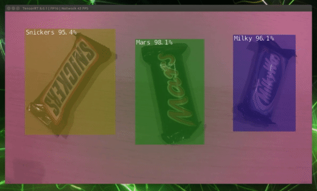

# Jetson Object Detector

This project is an example of a running Mobilenet V2 detector on a Jetson Nano using the ONNX Tensor RT runtime to get >30 fps performance. Models are trained using the excellent [PyTorch SSD project](https://medium.com/@smallfishbigsea/understand-ssd-and-implement-your-own-caa3232cd6ad) by Hao Gao.

This example uses a camera connected to the CSI camera interface, I used a Sony IMX219 sensor from [Arducam](https://www.arducam.com/product/8mp-imx219-175-degree-ultra-wide-angle-raspberry-pi-b0392/).

Getting the CSI interface working with Docker and Balena was can be quite tricky so hopefully this can be a useful resource for others.



## Install

The included Dockerfile is designed to run on [BalenaOS](https://www.balena.io/os/), which is a Yocto Linux distribution optimised to run containerised applications on embedded devices.

Installation can be done using the BalenaCLI:

```bash
balena login
```

```bash
balena push user/project
```

## CSI Camera Inteface on Docker/Jetson Nano

Two methods I've found for getting the CSI camera interface working with Docker/Balena on the Jetson nano are GStreamer + OpenCV or libArgus + ArgusCamera. The GStreamer + OpenCV method works but is quite heavy in terms of image size and runtime performance. If there's any desire for it I can upload an example using GStreamer.

In this project I'm using Nvidia's libArgus library + a python wrapper ArgusCamera. It's this section in the Dockerfile that does all the heavy lifting installing all the nvidia libraries, including the multimedia-api which includes libArgus so if you want to use it in any other projects just copy that line.

```docker
RUN apt-get update && apt-get install -y wget tar lbzip2 cuda-toolkit-10-2 cuda-compiler-10-2 libcudnn8 python3 python3-pip libegl1 mesa-common-dev libglu1-mesa-dev && \
    wget <https://developer.nvidia.com/embedded/L4T/r32_Release_v4.4/r32_Release_v4.4-GMC3/T210/Tegra210_Linux_R32.4.4_aarch64.tbz2> && \
    tar xf Tegra210_Linux_R32.4.4_aarch64.tbz2 && \
    cd Linux_for_Tegra && \
    sed -i 's/config.tbz2\"/config.tbz2\" --exclude=etc\/hosts --exclude=etc\/hostname/g' apply_binaries.sh && \
    sed -i 's/install --owner=root --group=root \"${QEMU_BIN}\" \"${L4T_ROOTFS_DIR}\/usr\/bin\/\"/#install --owner=root --group=root \"${QEMU_BIN}\" \"${L4T_ROOTFS_DIR}\/usr\/bin\/\"/g' nv_tegra/nv-apply-debs.sh && \
    sed -i 's/LC_ALL=C chroot . mount -t proc none \/proc/ /g' nv_tegra/nv-apply-debs.sh && \
    sed -i 's/umount ${L4T_ROOTFS_DIR}\/proc/ /g' nv_tegra/nv-apply-debs.sh && \
    sed -i 's/chroot . \//  /g' nv_tegra/nv-apply-debs.sh && \
    ./apply_binaries.sh -r / --target-overlay && cd .. \
    rm -rf Tegra210_Linux_R32.4.4_aarch64.tbz2 && \
    rm -rf Linux_for_Tegra && \
    apt-get install -o DPkg::Options::="--force-confnew" -y nvidia-l4t-jetson-multimedia-api swig git &&  \
    echo "/usr/lib/aarch64-linux-gnu/tegra" > /etc/ld.so.conf.d/nvidia-tegra.conf && \
    echo "/usr/lib/aarch64-linux-gnu/tegra-egl" > /etc/ld.so.conf.d/nvidia-tegra-egl.conf && ldconfig
```

I've modified the ArgusCamera wrapper to include parameters for AutoExposureLock, AutoWhiteBalanceLock, AutoWhiteBalanceMode, WhiteBalanceGains. My branch can be found here [ArgusCamera](https://github.com/richardw347/argus_camera/tree/awblock)
